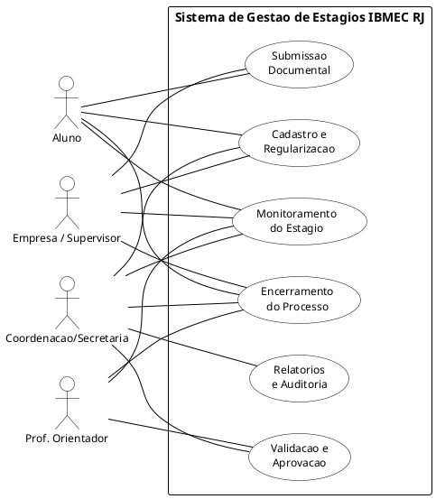
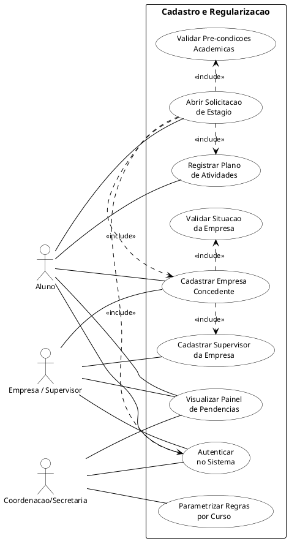
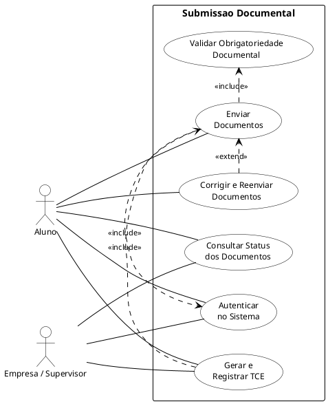

# Diagrama de Casos de Uso

## Objetivo

Este documento apresenta os Diagramas de Casos de Uso do Sistema de Gestão e Mediação de Estágios Obrigatórios do IBMEC RJ. A modelagem foi derivada do arquivo `documento_elicitacao_requisitos_estagio_ibmec.md` e do documento de especificação de casos de uso. Os diagramas foram divididos por fase do ciclo de vida do processo para manter a legibilidade dos atores e dos casos de uso.

## Premissas de modelagem

- O escopo cobre exclusivamente o fluxo de estágio obrigatório.
- Os diagramas foram separados em sete visões correspondentes ao ciclo de vida: Visão Geral, Cadastro e Regularização, Submissão Documental, Validação e Aprovação, Monitoramento, Encerramento e Relatórios e Auditoria.
- Relacionamentos `<<include>>` representam dependências obrigatórias entre casos de uso.
- Relacionamentos `<<extend>>` representam fluxos condicionais ou opcionais.
- Atores que não participam de uma fase não aparecem naquele diagrama, mantendo o foco visual.
- `Coordenacao/Secretaria` é tratada como um único ator até validação formal do papel junto ao cliente.

## Visão geral dos diagramas propostos

| Visão | Foco | Atores envolvidos |
| --- | --- | --- |
| Visão 0 — Geral | Mapa completo de atores e grupos de UC | Todos |
| Visão 1 — Cadastro | Abertura do processo e regularização | Aluno, Empresa/Supervisor, Coord./Secretaria |
| Visão 2 — Documentos | Submissão e controle documental | Aluno, Empresa/Supervisor |
| Visão 3 — Validação | Análise, parecer e aprovação | Prof. Orientador, Coord./Secretaria |
| Visão 4 — Monitoramento | Acompanhamento do estágio ativo | Aluno, Empresa/Supervisor, Prof. Orientador |
| Visão 5 — Encerramento | Relatório final e conclusão | Aluno, Empresa/Supervisor, Prof. Orientador, Coord./Secretaria |
| Visão 6 — Auditoria | Relatórios operacionais e trilha | Coord./Secretaria |

---

## Visão 0. Mapa geral de casos de uso

Visão panorâmica que posiciona os quatro atores e os grupos funcionais do sistema, sem detalhar os relacionamentos internos de cada fase.

### Leitura da visão

- A visão geral serve como índice visual: cada elipse representa um grupo de casos de uso detalhado nas visões seguintes.
- Todos os atores aparecem simultaneamente para evidenciar as fronteiras de responsabilidade de cada perfil.
- Os relacionamentos `<<include>>` e `<<extend>>` são detalhados nas visões específicas de cada fase.

---

## Visão 1. Cadastro e regularização

Cobre a abertura do processo de estágio, a validação de pré-condições acadêmicas, o cadastro da empresa e a parametrização das regras por curso.

### Leitura da visão

- `Abrir Solicitacao de Estagio` agrega obrigatoriamente quatro dependências: autenticação, pré-condições, plano de atividades e cadastro de empresa.
- `Validar Pre-condicoes Academicas` é executado pelo sistema automaticamente e verifica matrícula e frequência regulares (RN-02).
- `Validar Situacao da Empresa` verifica se a concedente possui situação documental e institucional apta, conforme RN-11.
- `Parametrizar Regras por Curso` é exclusivo da Coordenação/Secretaria, pois as regras variam por PPC e DCN (RN-04).

---

## Visão 2. Submissão documental

Cobre o envio, versionamento e validação de documentos, incluindo a geração ou registro do TCE e a correção de documentos devolvidos.

### Leitura da visão

- `Enviar Documentos` sempre inclui `Validar Obrigatoriedade Documental`, garantindo que documentos obrigatórios por etapa não sejam ignorados (RF-16, RF-21).
- `Gerar e Registrar TCE` inclui `Enviar Documentos` porque o TCE é tratado como um documento do processo com versionamento próprio (RF-19).
- `Corrigir e Reenviar Documentos` estende `Enviar Documentos` — só ocorre quando um documento foi rejeitado ou marcado como pendente (RF-17, RF-18).
- Tanto o Aluno quanto a Empresa participam do fluxo documental, pois o TCE exige participação de ambas as partes.

---