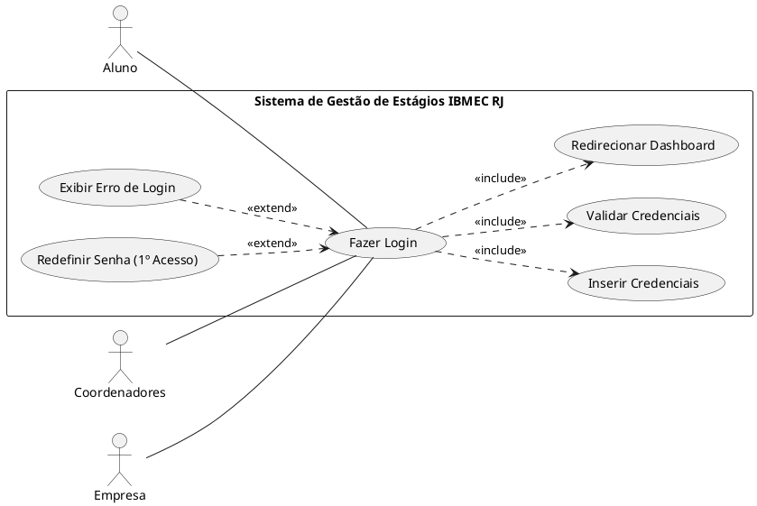
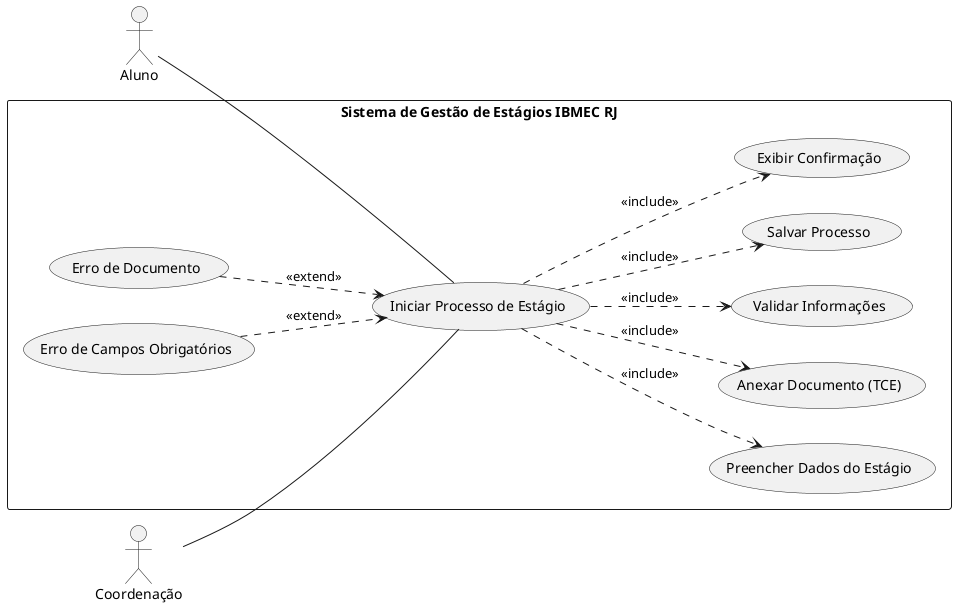
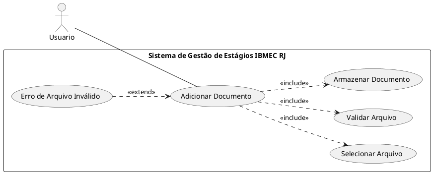
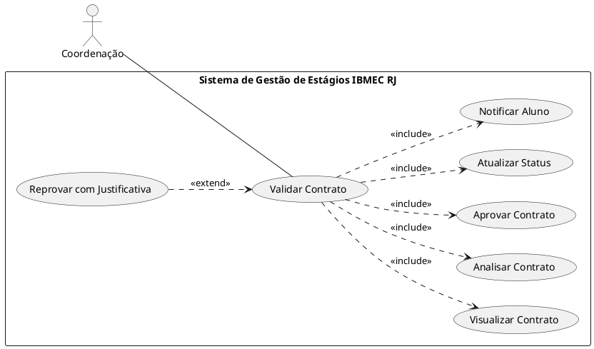
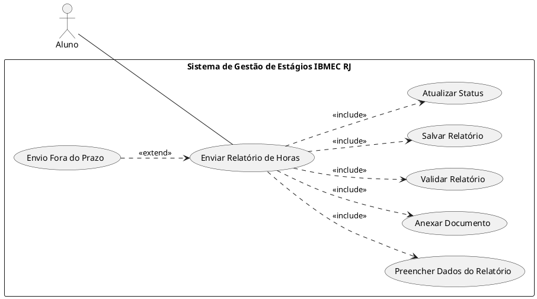
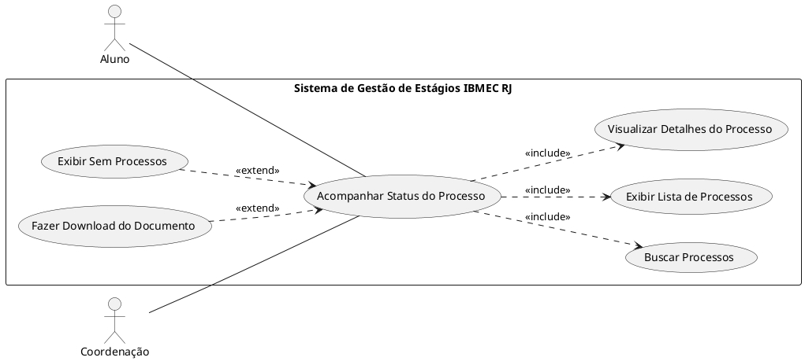
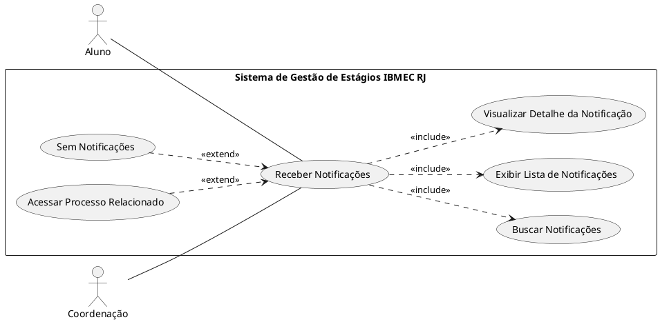
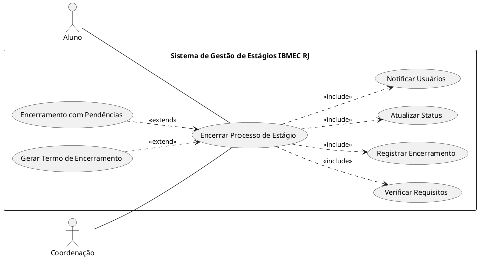
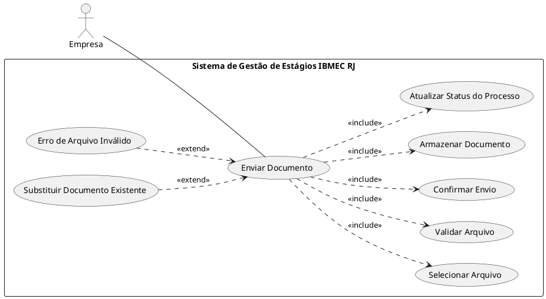
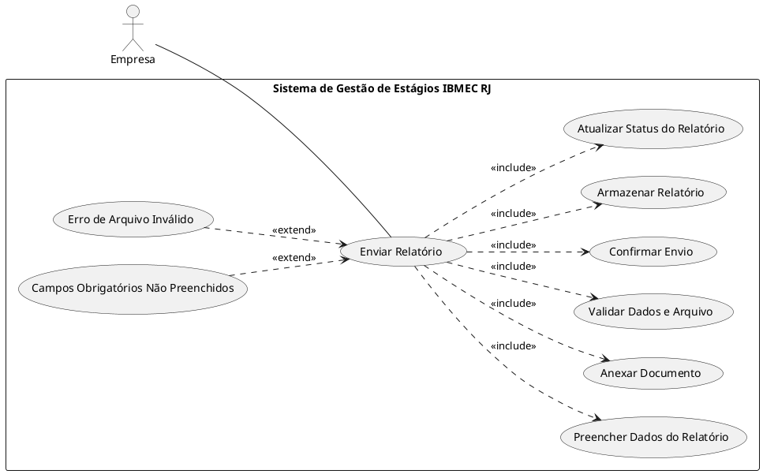

# Diagrama de Casos de Uso

## Objetivo

Este documento apresenta os Diagramas de Casos de Uso do Sistema de Gestão de Estágios do IBMEC RJ. O sistema tem como objetivo organizar, facilitar e automatizar o processo documental de estágio entre Aluno e Coordenador, considerando que o aluno já foi aprovado na vaga.

Os diagramas foram modelados de forma simples e didática, representando o ciclo básico do processo de estágio.

---

## Premissas de modelagem

- O sistema inicia após o aluno já ter sido aprovado em uma vaga de estágio.
- O foco está na gestão documental e acompanhamento do processo.
- Relacionamentos `<<include>>` representam ações obrigatórias.
- Relacionamentos `<<extend>>` representam fluxos alternativos ou opcionais.
- O sistema não é representado como ator.
- Diagramas simples, voltados para fácil compreensão.

---

## Visão geral dos casos de uso

| Fase | Casos de Uso |
|------|-------------|
| Acesso | Login |
| Início | Abrir Novo Processo |
| Documentação | Adicionar Documentos |
| Validação | Validar Contrato |
| Execução | Enviar Relatório |
| Monitoramento | Acompanhar Status |
| Comunicação | Notificações |
| Encerramento | Encerrar Processo |

---

# 1. Login

### Login

- Descrição: Permite que o usuário acesse o sistema por meio da validação de suas credenciais institucionais, garantindo segurança, controle de acesso e direcionamento ao ambiente correspondente ao seu perfil.

- Atores:
	- Aluno
	- Coordenação

- Pré-Condições:
	Usuário deve ter cadastrado já validado no sistema

- Fluxo Básico:
  - 1 Usuário acessa a página inicial do sistema.
	- 2 Usuário informa suas credenciais
  - 3 Usuário aciona a opção de login ("Entrar").
	- 4 Sistema valida as credenciais informadas.
  - 5 Sistema autentica o usuário e identifica seu perfil.
  - 6 Sistema redireciona o usuário para o dashboard correspondente.

- Fluxos Alternativos:
	- 4a. Credenciais inválidas: o sistema exibe a mensagem "Usuário ou senha incorretos", mantém o usuário na tela de login e limpa o campo de senha para nova tentativa.
	- 4b. Primeiro acesso: o sistema identifica que é o primeiro login do usuário e redireciona automaticamente para a tela de redefinição obrigatória de senha antes de permitir o acesso ao sistema.

- Pós-Condições:
 Sessão autenticada iniciada e usuário direcionado ao sistema.
 
# 2. Novo Processo

### Novo Processo

- Descrição: Permite ao usuário iniciar um novo processo de estágio, informando os dados necessários e anexando o Termo de Compromisso de Estágio para análise institucional.

- Atores:
	- Aluno
	- Coordenação

- Pré-Condições:
	O usuário deve estar logado no sistema e não possuir um processo ativo que entre em conflito com o novo cadastro.

- Fluxo Básico:
  - 1 Usuário acessa a opção "Iniciar Processo".
	- 2 Sistema exibe o formulário de cadastro do estágio.
	- 3 Usuário preenche os dados solicitados (empresa, datas e carga horária).
  - 4 Usuário anexa o documento obrigatório (TCE).
  - 5 Usuário confirma o envio do formulário.
  - 6 Sistema valida as informações e o arquivo anexado.
  - 7 Sistema registra o processo no banco de dados.
  - 8 Sistema exibe mensagem de confirmação ao usuário.

- Fluxos Alternativos:
	- 6a. Documento inválido: o sistema identifica erro de formato ou tamanho do arquivo, exibe mensagem informando o problema e solicita o reenvio do documento válido.
	- 6b. Campos obrigatórios não preenchidos: o sistema destaca os campos faltantes e impede o envio até que todas as informações sejam corretamente preenchidas.

- Pós-Condições:
 Um novo processo de estágio é criado com status "Pendente de Análise" e fica disponível para acompanhamento.

# 3. Add Documentos 

### Adicionar Documentos

- Descrição: Permite ao usuário anexar documentos adicionais ao processo de estágio, garantindo conformidade com os requisitos de formato e tamanho definidos pelo sistema.

- Atores:
	- Aluno
	- Coordenação

- Pré-Condições:
	O usuário deve estar logado e possuir um processo de estágio previamente criado.

- Fluxo Básico:
  - 1 Usuário acessa um processo existente.
	- 2 Usuário seleciona a opção "Adicionar Documento".
	- 3 Sistema abre o seletor de arquivos do dispositivo.
  - 4 Usuário escolhe o arquivo desejado.
  - 5 Sistema valida o formato e o tamanho do arquivo.
  - 6 Sistema armazena o documento vinculado ao processo.

- Fluxos Alternativos:
	- 5a. Arquivo inválido: o sistema identifica que o arquivo não atende aos requisitos (formato ou tamanho), exibe mensagem de erro e solicita a seleção de um novo arquivo válido.

- Pós-Condições:
	O documento é anexado com sucesso ao processo e fica disponível para visualização e análise.
  
# 4. Validar Contrato 

### Validar contrato

- Descrição: Permite que os coordenadores analisem contratos de estágio enviados, decidindo por sua aprovação ou reprovação com base nos critérios institucionais.

- Atores:
	- Coordenação

- Pré-condição:
  O usuário deve estar logado e deve existir pelo menos um contrato com status pendente de análise.

- Fluxo Básico:
  - 1 Secretaria acessa a lista de contratos pendentes.
	- 2 Sistema exibe os contratos disponíveis para análise.
	- 3 Secretaria seleciona um contrato específico.
  - 4 Sistema exibe o documento para visualização.
  - 5 Secretaria analisa as informações do contrato.
  - 6 Secretaria aprova o contrato.
  - 7 Sistema atualiza o status para "Aprovado".
  - 8 Sistema notifica o aluno sobre a decisão.

- Fluxos Alternativos:
	- 6a. Contrato com inconsistências: a Secretaria opta por reprovar o contrato, o sistema solicita o preenchimento de uma justificativa, registra a reprovação e notifica o aluno com o motivo informado.  

- Pós-Condições:
	O contrato passa a ter status "Aprovado" ou "Reprovado" e o resultado da análise fica registrado no sistema.

# 5. Enviar Relatório

### Enviar relatório

- Descrição:  Permite ao aluno registrar e enviar relatórios periódicos de atividades realizadas durante o estágio.

- Atores:
	- Aluno

- Pré-condição:
  O usuário deve estar logado e possuir um processo de estágio em andamento.

- Fluxo Básico:
  - 1 Aluno acessa os detalhes do estágio ativo.
	- 2 Aluno seleciona a opção "Adicionar Relatório".
	- 3 Sistema exibe o formulário de relatório.
  - 4 Aluno preenche os dados solicitados (período e horas).
  - 5 Aluno anexa o documento do relatório.
  - 6 Aluno confirma o envio.
  - 7 Sistema valida e salva o relatório.
  - 8 Sistema atualiza o status para "Aguardando Validação".

- Fluxos Alternativos:
	- 6a. Envio fora do prazo: o sistema exibe um alerta informando o atraso, permite o envio normalmente e registra o relatório com indicação de envio tardio.

  - Pós-Condições:
	O relatório é armazenado no sistema e vinculado ao processo do aluno para posterior análise.

# 6. Acompanhar status

### Acompanhar status

- Descrição: Permite ao usuário visualizar o andamento dos processos de estágio e acompanhar seu histórico de movimentações.

- Atores:
	- Aluno
	- Coordenação

- Pré-Condições:
  O usuário deve estar logado no sistema.

- Fluxo Básico:
  - 1 Usuário acessa o painel principal do sistema.
	- 2 Sistema busca os processos vinculados ao usuário.
	- 3 Sistema exibe a lista de processos com seus respectivos status.
  - 4 Usuário seleciona um processo específico.
  - 5 Sistema exibe os detalhes e o histórico de movimentações.

- Fluxos Alternativos:
	- 2a. Usuário sem processos: o sistema informa que não existem processos cadastrados e disponibiliza a opção de iniciar um novo processo.
	- 5a. Download de documento: o usuário opta por baixar um arquivo, o sistema inicia o download do documento selecionado para o dispositivo.

- Pós-Condições:
	Nenhuma alteração é realizada nos dados do sistema, sendo apenas uma operação de consulta.

# 7. Notificações

### Notificações

- Descrição: Permite ao usuário visualizar notificações relacionadas a eventos do sistema, como aprovações, reprovações e pendências.

- Atores:
	- Aluno
	- Coordenação

- Pré-condições: 
  O usuário deve estar logado no sistema.

- Fluxo Básico:
  - 1 Usuário acessa a área de notificações.
	- 2 Sistema busca as notificações disponíveis.
	- 3 Sistema exibe a lista de notificações.
  - 4 Usuário seleciona uma notificação.
  - 5 Sistema exibe os detalhes da notificação.

- Fluxos Alternativos:
	- 2a. Nenhuma notificação disponível: o sistema exibe mensagem informando que não há notificações no momento.
	- 5a. Acesso ao processo relacionado: o usuário opta por acessar o processo vinculado à notificação, e o sistema redireciona automaticamente para a tela correspondente.

- Pós-Condições:
	As notificações são visualizadas pelo usuário, sem alteração nos dados do sistema.

# 8. Encerrar Processo

### Encerrar Processo

- Descrição:  Permite finalizar oficialmente um processo de estágio após a verificação de que todos os requisitos foram cumpridos.

- Atores:
	- Aluno
	- Coordenação

- Pré-Condições:
	O usuário deve estar logado e o processo deve estar elegível para encerramento.

- Fluxo Básico:
  - 1  .Usuário acessa o processo desejado.
	- 2  Usuário seleciona a opção "Encerrar Processo". 
	- 3  Sistema verifica se todos os requisitos foram atendidos.
  - 4  Sistema registra o encerramento do processo.
  - 5 Sistema atualiza o status para "Finalizado".
  - 6 Sistema notifica os envolvidos sobre o encerramento.

- Fluxos Alternativos:
	- 3a. Existência de pendências: o sistema identifica requisitos não atendidos, informa ao usuário quais são as pendências e bloqueia o encerramento até que sejam resolvidas.
	- 5a. Geração de termo de encerramento: o sistema pode gerar automaticamente um documento formal de conclusão do estágio após o encerramento.

- Pós-Condições:
	O processo é finalizado e registrado no histórico do sistema como concluído.

# 9. Enviar Documentos (empresa)

### Enviar Documentos (Empresa)

- Descrição:  Permite que a empresa envie documentos necessários para o processo de estágio, como contratos assinados ou termos complementares, garantindo conformidade com as exigências institucionais.

- Atores:
	- Empresa

- Pré-Condições:
	O usuário da empresa deve estar logado no sistema e vinculado a um processo de estágio ativo.

- Fluxo Básico:
  - 1  Empresa acessa o processo de estágio vinculado.
	- 2  Empresa seleciona a opção "Enviar Documento".
	- 3  Sistema exibe o seletor de arquivos.
  - 4  Empresa escolhe o documento a ser enviado.
  - 5 Sistema valida o formato e o tamanho do arquivo.
  - 6 Empresa confirma o envio do documento.
  - 7 Sistema armazena o documento no processo.
  - 8 Sistema atualiza o status do processo, se aplicável.

- Fluxos Alternativos:
	- 5a. Arquivo inválido: o sistema identifica que o arquivo não atende aos requisitos (formato ou tamanho), exibe mensagem de erro e solicita o envio de um arquivo válido.
	- 8a. Documento substituído: caso já exista um documento do mesmo tipo, o sistema substitui o anterior e registra a atualização no histórico do processo.

- Pós-Condições:
	O documento enviado fica vinculado ao processo de estágio e disponível para análise pela instituição.

# 10. Enviar Relatório (Empresa)

### Enviar Relatório (Empresa)

- Descrição:  Permite que a empresa registre e envie relatórios ou avaliações sobre o desempenho do aluno durante o estágio.

- Atores:
	- Empresa

- Pré-Condições:
	O usuário da empresa deve estar logado no sistema e vinculado a um processo de estágio em andamento.

- Fluxo Básico:
  - 1  Empresa acessa o processo de estágio ativo.
	- 2  Empresa seleciona a opção "Enviar Relatório".
	- 3  Sistema exibe o formulário de relatório/avaliação.
  - 4  Empresa preenche as informações solicitadas (desempenho, período, observações).
  - 5 Empresa anexa o documento, se necessário.
  - 6 Empresa confirma o envio do relatório.
  - 7 Sistema valida as informações e o arquivo.
  - 8 Sistema armazena o relatório no processo.
  - 9 Sistema atualiza o status do relatório para "Enviado".

- Fluxos Alternativos:
	- 5a. Documento inválido: o sistema identifica erro no arquivo anexado, exibe mensagem e solicita correção antes do envio.
	- 7a. Campos obrigatórios não preenchidos: o sistema impede o envio, destaca os campos faltantes e solicita o preenchimento correto.

- Pós-Condições:
	O relatório da empresa é registrado no sistema e fica disponível para consulta e validação pela instituição.
s