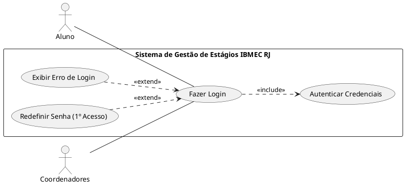
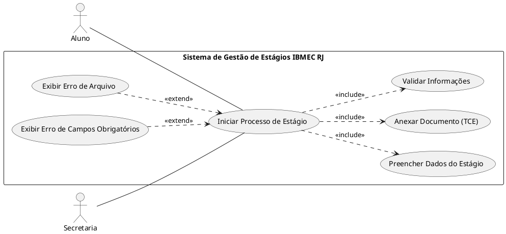
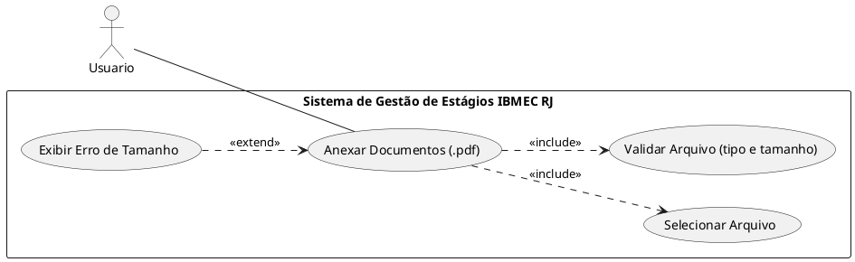
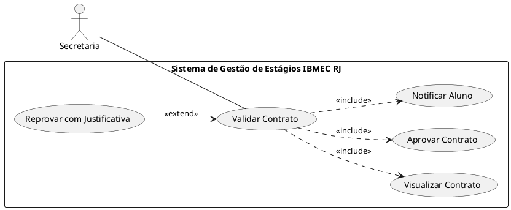
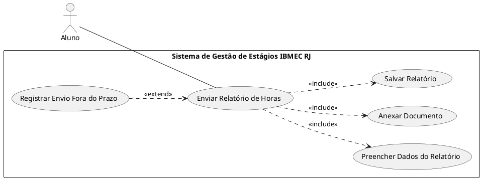
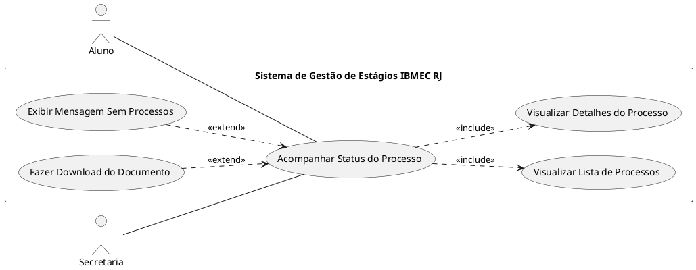
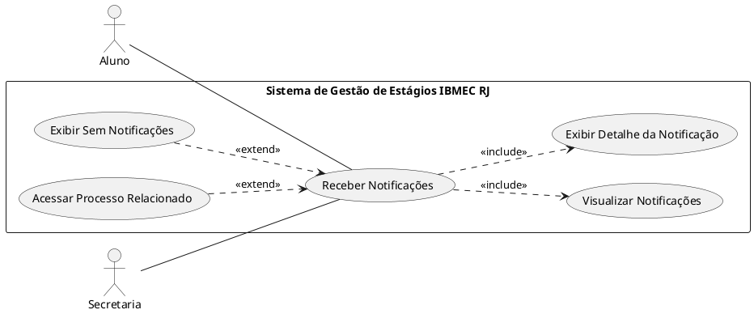
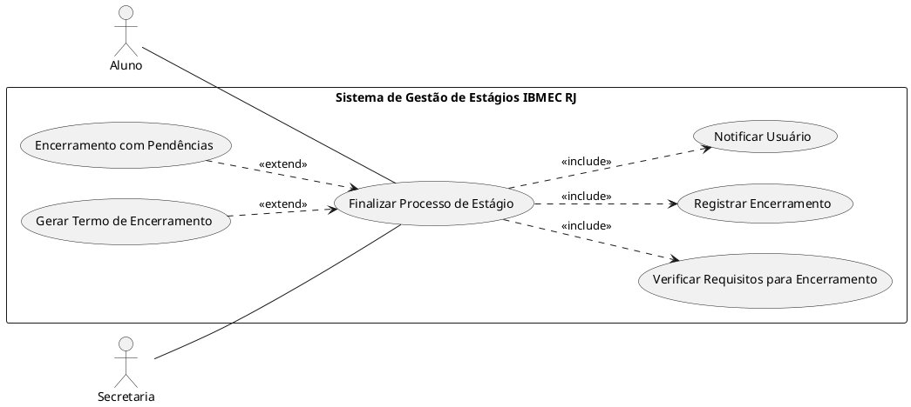

# Diagrama de Casos de Uso

## Objetivo

Este documento apresenta os Diagramas de Casos de Uso do Sistema de Gestão de Estágios do IBMEC RJ. O sistema tem como objetivo organizar, facilitar e automatizar o processo documental de estágio entre Aluno e Secretaria, considerando que o aluno já foi aprovado na vaga.

Os diagramas foram modelados de forma simples e didática, representando o ciclo básico do processo de estágio.

---

## Premissas de modelagem

- O sistema inicia após o aluno já ter sido aprovado em uma vaga de estágio.
- O foco está na gestão documental e acompanhamento do processo.
- Relacionamentos `<<include>>` representam ações obrigatórias.
- Relacionamentos `<<extend>>` representam fluxos alternativos ou opcionais.
- O sistema não é representado como ator.
- Diagramas simples, voltados para fácil compreensão.

---

## Visão geral dos casos de uso

| Fase | Casos de Uso |
|------|-------------|
| Acesso | Login |
| Início | Abrir Novo Processo |
| Documentação | Adicionar Documentos |
| Validação | Validar Contrato |
| Execução | Enviar Relatório |
| Monitoramento | Acompanhar Status |
| Comunicação | Notificações |
| Encerramento | Encerrar Processo |

---

# 1. Login

### Login

- Atores:
	- Aluno
	- Coordenação

- Pré-Condições:
	Usuário deve ter cadastrado

- Fluxo Básico:
    - 1. Usuário acessa a página inicial.
	- 2. Usuário informa credenciais.
	- 3. Sistema valida login.
  - 4. Sistema redireciona ao dashboard.

- Fluxos Alternativos:
	- Erro de login → exibe mensagem
	- Primeiro acesso → redefinição de senha

- Pós-Condições:
 Sessão autenticada iniciada e usuário direcionado ao sistema.
 
# 2. Novo Processo

### Novo Processo

- Atores:
	- Aluno
	- Coordenação

- Pré-Condições:
	Usuário deve ter cadastrado

- Fluxo Básico:
    - 1. Usuário acessa a página inicial.
	- 2. Usuário informa credenciais.
	- 3. Sistema valida login.
  - 4. Sistema redireciona ao dashboard.

- Fluxos Alternativos:
	- Erro de login → exibe mensagem
	- Primeiro acesso → redefinição de senha

- Pós-Condições:
 Processo criado e armazenado com status "Pendente de Análise".

# 3. Add Documentos 

### Adicionar Documentos
- Atores:
	- Aluno
	- Coordenação

- Pré-Condições:
	Processo existente.

- Fluxo Básico:
    - 1. Seleciona arquivo
	- 2. Valida arquivo
	- 3. Salva arquivo

- Fluxos Alternativos:
	- Arquivo inválido

- Pós-Condições:
	Documento anexado corretamente ao processo.
  
# 4. Validar Contrato 

### Validar contrato
- Atores:
	- Coordenação

- Fluxo Básico:
    - 1. Seleciona contrato
	- 2. Analisa contrato
	- 3. Aprova contrato

- Fluxos Alternativos:
	- Reprovação com justificativa

- Pós-Condições:
	Contrato atualizado com status "Aprovado" ou "Reprovado" e aluno notificado.

# 5. Enviar Relatório

### Enviar relatório

- Atores:
	- Aluno

- Fluxo Básico:
    - 1. Preenche o relatório
	- 2. Anexa arquivos
	- 3. Envia relatório
  - 4. Sistema valida e salva.

- Fluxos Alternativos:
	- Envio fora do prazo
	- Campos obrigatórios não preenchidos

  - Pós-Condições:
	Relatório salvo e status atualizado para "Aguardando Validação".

# 6. Acompanhar status

### Acompanhar status

- Atores:
	- Aluno
	- Coordenação

- Pré-Condições:
	Usuário deve estar logado

- Fluxo Básico:
    - 1. Usuário acessa a página visualizar status
	- 2. Visualiza listas e ocorrencias pendentes
	- 3. Acessa detalhes

- Fluxos Alternativos:
	- Sem processos
	- Download de documento

- Pós-Condições:
	Nenhuma alteração nos dados; apenas consulta realizada

# 7. Notificações

### Notificações

- Atores:
	- Aluno
	- Coordenação

- Fluxo Básico:
    - 1. Usuário acessa a página de notificações
	- 2. Visualiza notificações
	- 3. Abre a aba detalhes
  - 4. Sistema redireciona ao dashboard.

- Fluxos Alternativos:
	- Sem notificações
	- Acesso ao processo

- Pós-Condições:
	Notificações visualizadas pelo usuário

# 8. Encerrar Processo

### Encerrar Processo

- Atores:
	- Aluno
	- Coordenação

- Pré-Condições:
	Usuário deve ter concluído todas as etapas

- Fluxo Básico:
    - 1. Verifica requisitos
	- 2. Informa a conclusão do processo
	- 3. Encerra o processo
  - 4. Notifica o encerramento do processo

- Fluxos Alternativos:
	- Ainda há Pendências
	- Geração de termo de conclusão

- Pós-Condições:
	Processo encerrado e registrado no histórico