# Diagrama de Classes

## Objetivo

Este documento apresenta o modelo de classes conceitual do Sistema de Gestão e Mediação de Estágios Obrigatórios do IBMEC RJ. A modelagem foi derivada do arquivo `documento_elicitacao_requisitos_estagio_ibmec.md` e, nesta fase de elaboração, mostra apenas classes e relacionamentos UML, sem atributos e sem métodos.

## Premissas de modelagem

- O recorte considera somente o fluxo de estágio obrigatório.
- As classes foram organizadas em três blocos para manter legibilidade: identidade e atores, núcleo do processo e acompanhamento/auditoria.
- Estados, permissões detalhadas e campos internos não aparecem como classes neste momento.
- `CoordenacaoSecretaria` foi mantida como uma única classe até a validação do papel exato de coordenação e secretaria junto ao cliente.
- TCE, convênio, termo de realização e demais artefatos legais continuam representados por `Documento` e `TipoDocumento`, evitando especializações prematuras.

## Visão geral das classes propostas

| Bloco | Classes |
| --- | --- |
| Identidade e atores | `Usuario`, `Perfil`, `Aluno`, `ProfessorOrientador`, `CoordenacaoSecretaria`, `SupervisorEmpresa`, `EmpresaConcedente`, `Curso`, `RegraCurso` |
| Núcleo do processo | `ProcessoEstagio`, `PlanoAtividades`, `Documento`, `TipoDocumento`, `Aprovacao`, `Pendencia`, `HistoricoStatus`, `Aditivo`, `Rescisao` |
| Acompanhamento e governança | `RegistroCargaHoraria`, `RelatorioPeriodico`, `RelatorioFinal`, `AvaliacaoDesempenho`, `ParecerAcademico`, `Notificacao`, `LogAuditoria` |

## Visão 1. Identidade, atores e contexto acadêmico

Para reduzir cruzamentos, padronizar a escala visual e evitar rótulos sobre linhas, a visão de identidade foi dividida em recortes menores com layout mais controlado.

### Visão 1A. Hierarquia de usuários e perfis

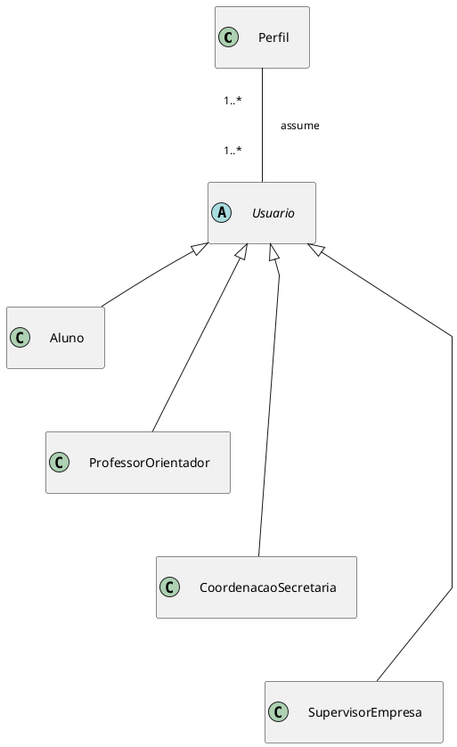

### Visão 1B. Contexto acadêmico e institucional

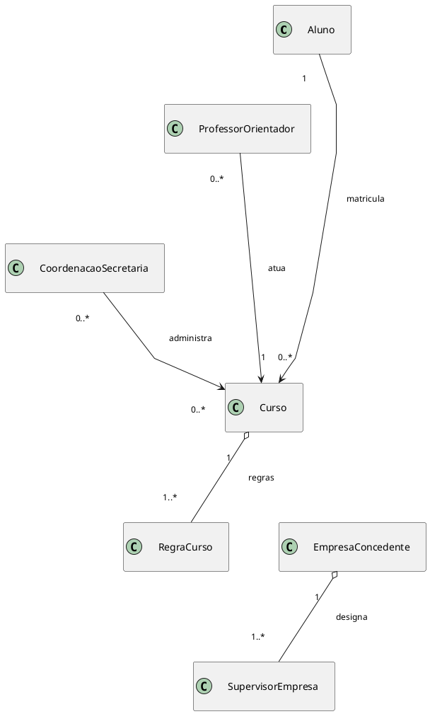

### Leitura da visão

- `Aluno`, `ProfessorOrientador`, `CoordenacaoSecretaria` e `SupervisorEmpresa` continuam como especializações de `Usuario`, mas agora aparecem isolados do contexto acadêmico para facilitar leitura.
- `Perfil` permanece separado para refletir o requisito de permissões por papel e permitir evolução futura do controle de acesso.
- `EmpresaConcedente` foi separada da hierarquia de usuários porque é uma organização do domínio, não uma conta base do sistema.
- `Curso` e `RegraCurso` ficaram em um diagrama próprio para evidenciar as regras acadêmicas sem poluir a visão de autenticação.

## Visão 2. Núcleo do processo de estágio

O núcleo do processo foi reorganizado em recortes mais curtos para manter a mesma legibilidade visual entre os blocos e reduzir desvio das setas.

### Visão 2A. Abertura do processo e regra acadêmica

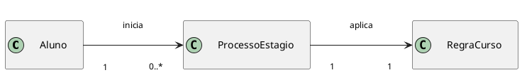

### Visão 2B. Vínculos institucionais do processo

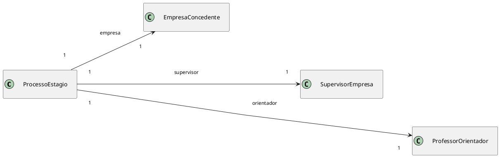

### Visão 2C. Estrutura documental do processo

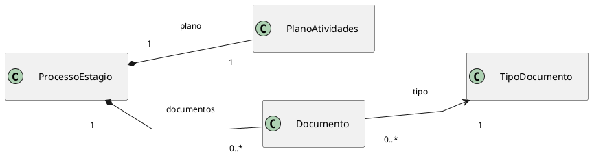

### Visão 2D. Aprovação e pendências

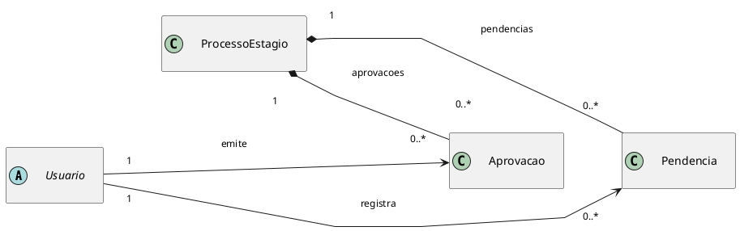

### Visão 2E. Histórico e encerramento

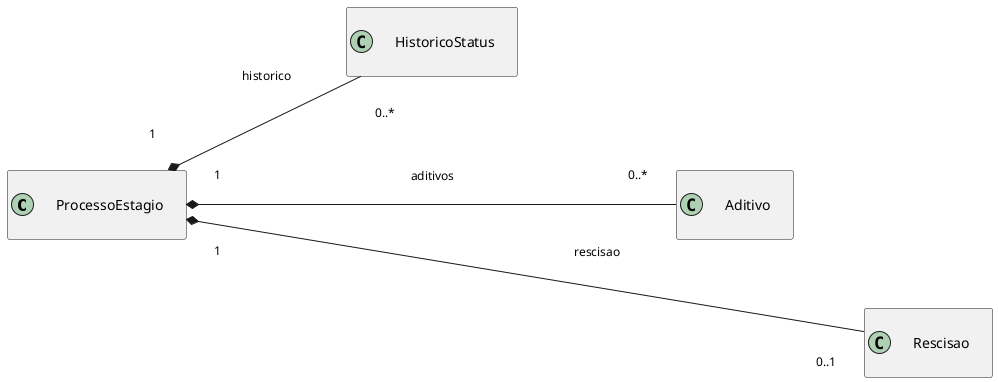

### Leitura da visão

- `ProcessoEstagio` continua como agregado principal, mas os relacionamentos foram separados por intenção: abertura, vínculos institucionais, documentação, aprovação e encerramento.
- `PlanoAtividades`, `Documento` e `TipoDocumento` ficaram em um recorte dedicado para destacar a estrutura documental sem misturar atores externos.
- `Aprovacao`, `Pendencia`, `HistoricoStatus`, `Aditivo` e `Rescisao` foram repartidos em blocos menores para reduzir cruzamentos e sobreposição de rótulos.
- O layout foi padronizado com setas mais curtas, rótulos menores e caminhos menos tortuosos.

## Visão 3. Acompanhamento, encerramento e rastreabilidade

O acompanhamento posterior à aprovação também foi padronizado para manter escala semelhante entre os blocos e evitar diferenças excessivas de tamanho visual.

### Visão 3A. Registro de horas e entregas do aluno

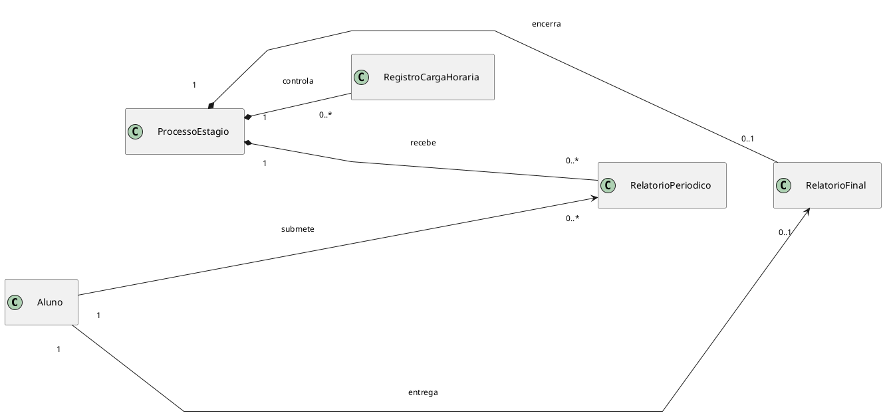

### Visão 3B. Avaliações e pareceres

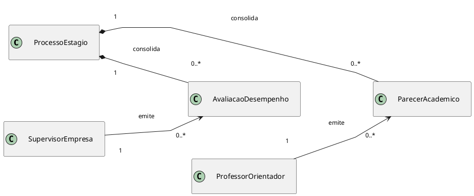

### Visão 3C. Tipos documentais do acompanhamento

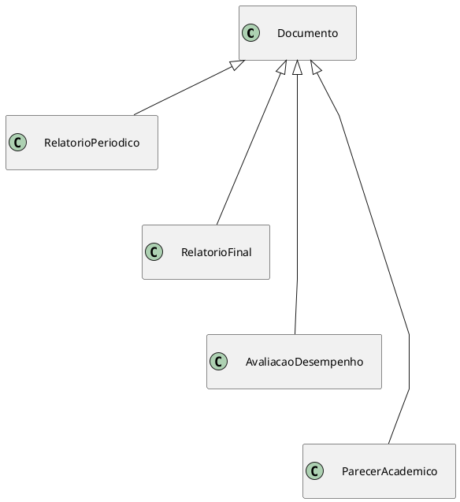

### Visão 3D. Notificações e auditoria

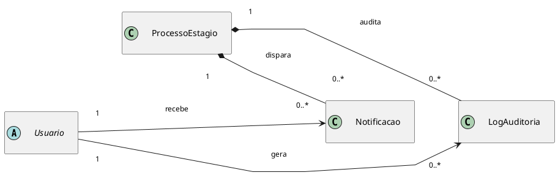

### Leitura da visão

- `RegistroCargaHoraria`, `RelatorioPeriodico` e `RelatorioFinal` foram mantidos juntos porque representam o acompanhamento operacional do aluno.
- `AvaliacaoDesempenho` e `ParecerAcademico` ficaram em um recorte separado para destacar os emissores distintos e evitar sobreposição com relatórios do aluno.
- As especializações de `Documento` foram agrupadas em um diagrama próprio, mais simples, para deixar a herança clara sem cruzar setas com o restante do fluxo.
- `Notificacao` e `LogAuditoria` ganharam um recorte independente para representar a camada institucional sem poluir as relações de acompanhamento.

## Decisões de modelagem que ainda dependem de validação

- Confirmar se `CoordenacaoSecretaria` deve ser quebrada em duas classes distintas.
- Validar se `SupervisorEmpresa` é o único representante autenticado da empresa ou se haverá um papel adicional para cadastro institucional.
- Decidir se `Convenio` ou `TermoCooperacao` precisam virar classes próprias em vez de permanecerem como tipos documentais.
- Refinar se `Aprovacao` continuará genérica ou se será desdobrada em classes mais específicas de análise institucional e análise acadêmica.
- Verificar se `RegistroCargaHoraria` será um lançamento manual recorrente ou uma consolidação derivada de relatórios.

## Síntese

O modelo proposto posiciona `ProcessoEstagio` como centro do domínio e distribui o restante das classes entre três preocupações principais: identidade dos atores, formalização do processo e acompanhamento auditável do estágio. Esse recorte é suficiente para orientar a próxima etapa de detalhamento do back-end sem antecipar atributos, métodos ou decisões de persistência que ainda dependem de validação com o cliente.
