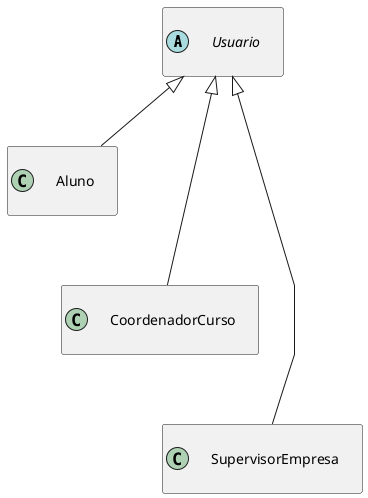
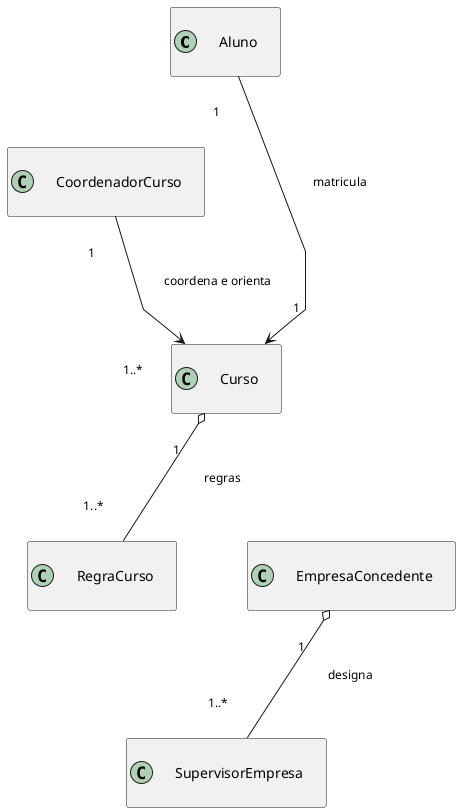
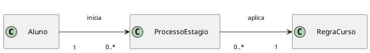
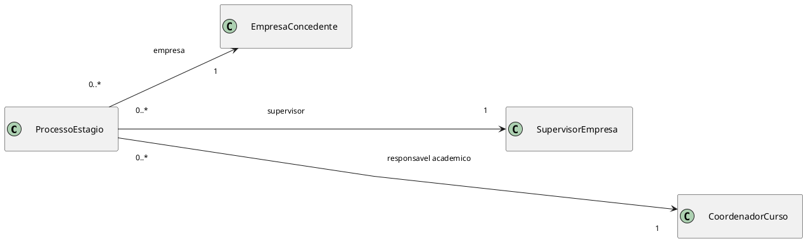
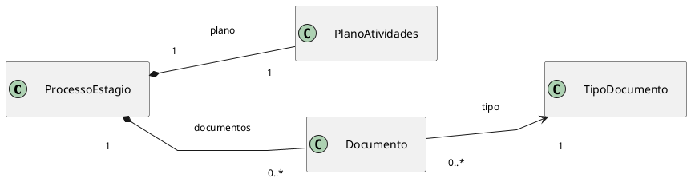
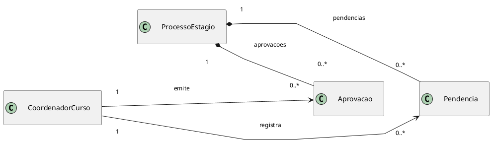
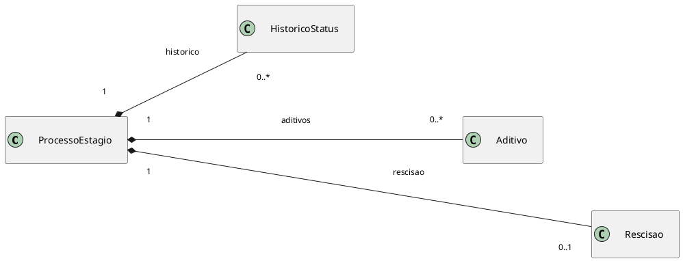
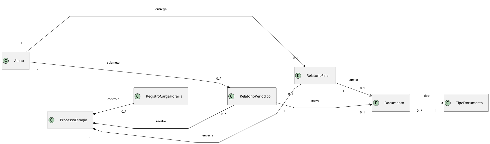
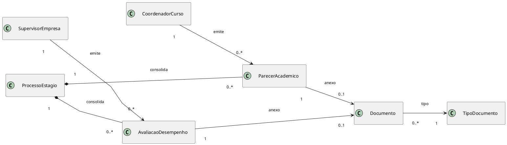
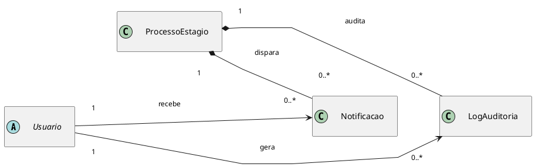

# Diagrama de Classes

## Objetivo

Este documento apresenta o modelo de classes conceitual do Sistema de Gestão e Mediação de Estágios Obrigatórios do IBMEC RJ. A modelagem foi derivada do arquivo `documento_elicitacao_requisitos_estagio_ibmec.md` e, nesta fase de elaboração, mostra apenas classes e relacionamentos UML, sem atributos e sem métodos.

## Premissas de modelagem

- O recorte considera somente o fluxo de estágio obrigatório.
- As classes foram organizadas em três blocos para manter legibilidade: identidade e atores, núcleo do processo e acompanhamento/auditoria.
- Estados, permissões detalhadas e campos internos não aparecem como classes neste momento.
- `Usuario` foi mantida como classe abstrata para representar dados e comportamentos comuns de autenticação, identificação e rastreabilidade.
- `Perfil` não foi mantida como classe neste recorte conceitual. As permissões continuam existindo, mas são tratadas como regras associadas ao tipo de usuário.
- `CoordenadorCurso` representa o responsável acadêmico pelo estágio. No contexto do IBMEC, essa classe também cobre a função de orientação que antes poderia ser atribuída a um professor orientador separado.
- Secretaria e demais apoios administrativos não foram modelados como classes centrais nesta versão; se necessário, podem ser tratados futuramente como permissões operacionais de usuário.
- TCE, convênio, termo de realização e demais artefatos legais continuam representados por `Documento` e `TipoDocumento`, evitando especializações prematuras.
- `Documento` não foi modelada como classe abstrata. Ela representa o anexo ou registro documental concreto, enquanto `TipoDocumento` representa sua classificação. Relatórios, avaliações e pareceres são registros de negócio que podem apontar para um documento anexado.

## Visão geral das classes propostas

| Bloco | Classes |
| --- | --- |
| Identidade e atores | `Usuario`, `Aluno`, `CoordenadorCurso`, `SupervisorEmpresa`, `EmpresaConcedente`, `Curso`, `RegraCurso` |
| Núcleo do processo | `ProcessoEstagio`, `PlanoAtividades`, `Documento`, `TipoDocumento`, `Aprovacao`, `Pendencia`, `HistoricoStatus`, `Aditivo`, `Rescisao` |
| Acompanhamento e governança | `RegistroCargaHoraria`, `RelatorioPeriodico`, `RelatorioFinal`, `AvaliacaoDesempenho`, `ParecerAcademico`, `Notificacao`, `LogAuditoria` |

## Papel das classes no modelo

As classes do diagrama foram escolhidas para representar conceitos persistentes do domínio, isto é, informações que precisam ser consultadas, validadas ou auditadas ao longo do processo de estágio. Por isso, o modelo inclui não apenas atores, mas também registros formais do ciclo de vida do processo.

| Classe | Papel no domínio |
| --- | --- |
| `Usuario` | Classe abstrata para representar qualquer pessoa autenticável no sistema. Serve como base para aluno, coordenador e supervisor. |
| `Aluno` | Usuário que abre o processo de estágio, envia documentos, acompanha pendências e entrega relatórios. |
| `CoordenadorCurso` | Usuário responsável pela validação acadêmica do estágio. No contexto do IBMEC, acumula a função de coordenação e orientação acadêmica. |
| `SupervisorEmpresa` | Usuário vinculado à empresa concedente, responsável pelo acompanhamento do aluno no ambiente de estágio. |
| `EmpresaConcedente` | Organização onde o estágio será realizado. Uma mesma empresa pode estar ligada a vários processos. |
| `Curso` | Curso do aluno, usado para contextualizar regras acadêmicas e responsabilidade do coordenador. |
| `RegraCurso` | Conjunto de regras acadêmicas aplicáveis ao estágio, como carga horária, documentos obrigatórios e critérios de validação. |
| `ProcessoEstagio` | Classe central do modelo. Representa a solicitação e todo o ciclo de vida do estágio obrigatório. |
| `PlanoAtividades` | Registro das atividades previstas para o estágio. Foi modelado como classe porque precisa ser validado academicamente e permanecer vinculado ao processo aprovado. |
| `Documento` | Anexo ou registro documental concreto associado ao processo, como um arquivo enviado, um termo assinado ou um comprovante. |
| `TipoDocumento` | Classificação do documento, permitindo diferenciar TCE, relatório, avaliação, termo de realização, aditivo e outros documentos sem criar uma classe para cada tipo de arquivo. |
| `Aprovacao` | Registro formal de uma decisão positiva tomada pelo responsável acadêmico ou institucional. Guarda a rastreabilidade da aprovação. |
| `Pendencia` | Registro de algo que impede o avanço do processo, como documento incorreto, ausência de informação ou necessidade de correção. |
| `HistoricoStatus` | Linha do tempo das mudanças de status do processo, como rascunho, em análise, aprovado, ativo, encerrado ou rescindido. |
| `Aditivo` | Registro formal de alteração em um estágio já aprovado, como prorrogação, mudança de jornada, troca de supervisor ou alteração do plano de atividades. |
| `Rescisao` | Registro do encerramento antecipado do estágio, com motivo, data e documentação associada. |
| `RegistroCargaHoraria` | Controle das horas realizadas e validadas durante o estágio. |
| `RelatorioPeriodico` | Registro de entrega parcial feita durante o acompanhamento do estágio. Pode estar associado a um `Documento` anexado. |
| `RelatorioFinal` | Registro de encerramento entregue ao final do estágio. Pode estar associado a um `Documento` anexado. |
| `AvaliacaoDesempenho` | Registro da avaliação emitida pelo supervisor da empresa sobre a atuação do aluno. Pode estar associado a um `Documento` anexado. |
| `ParecerAcademico` | Registro do parecer emitido pelo coordenador sobre a aderência acadêmica do estágio. Pode estar associado a um `Documento` anexado. |
| `Notificacao` | Comunicação enviada aos usuários sobre mudanças, pendências, aprovações ou prazos. |
| `LogAuditoria` | Registro técnico de ações relevantes para rastreabilidade e auditoria institucional. |

## Fluxo conceitual representado

O modelo parte da solicitação aberta pelo `Aluno` e organiza o restante do fluxo em torno de `ProcessoEstagio`. O processo aplica uma `RegraCurso`, recebe documentos, vincula a empresa concedente, registra o supervisor da empresa e atribui um `CoordenadorCurso` como responsável acadêmico.

Durante a análise, o `CoordenadorCurso` valida a compatibilidade do estágio com o curso, emite aprovações, registra pendências e produz pareceres acadêmicos. O `SupervisorEmpresa` permanece responsável pelo acompanhamento do aluno dentro da concedente e pela avaliação de desempenho. Ao longo do ciclo, o sistema registra documentos, relatórios, carga horária, histórico de status, notificações e logs de auditoria.

No fluxo documental, `Documento` e `TipoDocumento` trabalham juntos: `Documento` é a ocorrência concreta anexada ao processo; `TipoDocumento` informa o que aquele anexo representa. Assim, um relatório periódico, uma avaliação de desempenho ou um parecer acadêmico podem existir como registros do acompanhamento e, quando houver arquivo associado, apontar para um `Documento` classificado pelo respectivo `TipoDocumento`.

## Visão 1. Identidade, atores e contexto acadêmico

Para reduzir cruzamentos, padronizar a escala visual e evitar rótulos sobre linhas, a visão de identidade foi dividida em recortes menores com layout mais controlado.

### Visão 1A. Hierarquia de usuários

### Visão 1B. Contexto acadêmico e institucional

### Leitura da visão

- `Aluno`, `CoordenadorCurso` e `SupervisorEmpresa` continuam como especializações de `Usuario`, mas aparecem isolados do contexto acadêmico para facilitar leitura.
- `Usuario` concentra a noção comum de conta autenticável. Permissões específicas não aparecem como classe própria, pois são regras derivadas do tipo de usuário.
- `CoordenadorCurso` acumula a coordenação do curso e a responsabilidade de orientação acadêmica do estágio, conforme a regra institucional assumida para o IBMEC.
- `EmpresaConcedente` foi separada da hierarquia de usuários porque é uma organização do domínio, não uma conta base do sistema.
- `Curso` e `RegraCurso` ficaram em um diagrama próprio para evidenciar as regras acadêmicas sem poluir a visão de autenticação.

## Visão 2. Núcleo do processo de estágio

O núcleo do processo foi reorganizado em recortes mais curtos para manter a mesma legibilidade visual entre os blocos e reduzir desvio das setas.

### Visão 2A. Abertura do processo e regra acadêmica

### Visão 2B. Vínculos institucionais do processo

### Visão 2C. Estrutura documental do processo

Este recorte mostra os elementos que formalizam a solicitação. O `PlanoAtividades` representa o planejamento acadêmico do estágio: atividades previstas, relação com o curso e base para a validação do coordenador. Ele aparece como classe própria porque não é apenas um arquivo anexado; é uma parte estruturante do processo e pode ser analisado, aprovado, corrigido ou alterado por aditivo.

### Visão 2D. Aprovação e pendências

Este recorte representa a etapa de decisão. `Aprovacao` e `Pendencia` foram modeladas como classes porque registram eventos auditáveis do processo: quem aprovou, quando aprovou, o que ficou pendente, qual correção foi solicitada e se a pendência foi resolvida. Isso evita que decisões importantes fiquem apenas como texto solto dentro de `ProcessoEstagio`.

### Visão 2E. Histórico e encerramento

Este recorte registra mudanças relevantes depois da abertura do processo. `HistoricoStatus` mantém a linha do tempo do estágio; `Aditivo` representa alterações formais em um estágio já aprovado; e `Rescisao` representa encerramento antecipado. Essas classes preservam o histórico do processo sem sobrescrever informações originais.

### Leitura da visão

- `ProcessoEstagio` continua como agregado principal, mas os relacionamentos foram separados por intenção: abertura, vínculos institucionais, documentação, aprovação e encerramento.
- `CoordenadorCurso` aparece como responsável acadêmico do processo e concentra as ações de aprovação e registro de pendências.
- As multiplicidades indicam que cada processo possui uma empresa, um supervisor e um coordenador responsável, mas cada uma dessas classes pode estar vinculada a vários processos de estágio.
- A mesma `RegraCurso` pode ser aplicada a vários processos, garantindo reutilização das regras acadêmicas de um curso sem criar uma regra nova para cada solicitação.
- `PlanoAtividades`, `Documento` e `TipoDocumento` ficaram em um recorte dedicado para destacar a estrutura documental sem misturar atores externos. O plano foi tratado como classe porque é uma peça acadêmica validável, não apenas um anexo genérico.
- `Aprovacao`, `Pendencia`, `HistoricoStatus`, `Aditivo` e `Rescisao` foram repartidos em blocos menores para reduzir cruzamentos e sobreposição de rótulos. Essas classes representam registros formais do processo, necessários para rastreabilidade e auditoria.
- O layout foi padronizado com setas mais curtas, rótulos menores e caminhos menos tortuosos.

## Visão 3. Acompanhamento, encerramento e rastreabilidade

O acompanhamento posterior à aprovação também foi padronizado para manter escala semelhante entre os blocos e evitar diferenças excessivas de tamanho visual. Nesta visão, relatórios, avaliações e pareceres não aparecem como subclasses de `Documento`; eles são registros do acompanhamento que podem apontar para um anexo documental classificado por `TipoDocumento`.

### Visão 3A. Registro de horas e entregas do aluno

### Visão 3B. Avaliações e pareceres

### Visão 3C. Notificações e auditoria

### Leitura da visão

- `RegistroCargaHoraria`, `RelatorioPeriodico` e `RelatorioFinal` foram mantidos juntos porque representam o acompanhamento operacional do aluno.
- `AvaliacaoDesempenho` e `ParecerAcademico` ficaram em um recorte separado para destacar os emissores distintos: a avaliação operacional vem do `SupervisorEmpresa`, enquanto o parecer acadêmico vem do `CoordenadorCurso`.
- `RelatorioPeriodico`, `RelatorioFinal`, `AvaliacaoDesempenho` e `ParecerAcademico` podem ter anexos, mas não herdam de `Documento`. Essa separação deixa claro que `Documento` representa o arquivo ou registro documental concreto, enquanto essas classes representam eventos ou entregas do acompanhamento.
- `TipoDocumento` classifica cada `Documento`, permitindo que o mesmo mecanismo documental seja usado para TCE, relatórios, avaliações, pareceres, aditivos e demais anexos.
- `Notificacao` e `LogAuditoria` ganharam um recorte independente para representar a camada de rastreabilidade sem poluir as relações de acompanhamento.

## Decisões de modelagem que ainda dependem de validação

- Validar se `SupervisorEmpresa` é o único representante autenticado da empresa ou se haverá um papel adicional para cadastro institucional.
- Decidir se `Convenio` ou `TermoCooperacao` precisam virar classes próprias em vez de permanecerem como tipos documentais.
- Refinar se `Aprovacao` continuará genérica ou se será desdobrada em classes mais específicas, como aprovação documental, aprovação acadêmica e aprovação de encerramento.
- Verificar se `RegistroCargaHoraria` será um lançamento manual recorrente ou uma consolidação derivada de relatórios.
- Confirmar se, em versões futuras, secretaria e apoio administrativo precisarão de classes próprias ou se continuarão como permissões operacionais associadas a `Usuario`.

## Síntese

O modelo proposto posiciona `ProcessoEstagio` como centro do domínio e distribui o restante das classes entre três preocupações principais: identidade dos atores, formalização do processo e acompanhamento auditável do estágio. O `CoordenadorCurso` passa a ser o responsável acadêmico único dentro do IBMEC, acumulando a validação antes associada ao professor orientador. Esse recorte é suficiente para orientar a próxima etapa de detalhamento do back-end sem antecipar atributos, métodos ou decisões de persistência que ainda dependem de validação com o cliente.

## Autor(es)
| Data | Versão | Descrição | Autor(es) |
| -- | -- | -- | -- |
| 11/04/2026 | 1.0 | Criação do documento | João Gabriel |
| 15/04/2026 | 2.0 | Atualização do documento consertando as cardialidades das classes e removendo classes desnecessárias | João Gabriel |