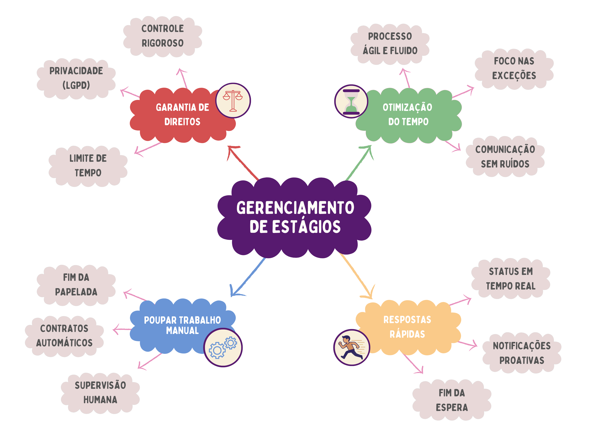

# 🌸 Mapa Mental do site de Gerenciamento de Estágios para o IBMEC 🌸

## 🎀 Introdução
 
<p align = "justify">
Mapa mental consiste em criar resumos cheios de símbolos, cores, setas e frases de efeito com o objetivo de organizar o conteúdo e facilitar associações entre as informações destacadas. Esse material é muito indicado para pessoas que têm facilidade de aprender de forma visual.
</p>
 
## 🎀 Metodologia
 
<p align="justify"> A construção do mapa mental foi fundamentada na técnica de <b>Visual Thinking</b>, priorizando a síntese de ideias complexas em pilares fundamentais. O processo metodológico consistiu em: </p>

-   **Levantamento de Requisitos:**  Identificação das principais dores do processo atual de estágios, como o excesso de burocracia física e a falta de transparência no status das solicitações.
   -   **Agrupamento Temático:**  Organização das funcionalidades em quatro eixos estratégicos: Automação, Experiência do Aluno, Eficiência Operacional e Conformidade Legal.
   -   **Priorização de Valor:**  Seleção de conceitos-chave que demonstram o impacto direto do sistema, como a garantia de direitos e a otimização do tempo da coordenação.
  -   **Design Centrado no Usuário:**  Utilização de uma estética visual organizada e minimalista para garantir que a proposta de valor do projeto seja compreendida de forma imediata e intuitiva.
---
 
## 🎀 Mapa mental 1 - Ideias
 
[]
 
## 🎀 Mapa mental 2 - Visão Técnica

```plantuml
@startmindmap
<style>
mindmapDiagram {
    .projeto {
        BackgroundColor #571a6f
        FontColor white
        Fontsize 22
    }
    .azul {
        BackgroundColor #b2d4ef
        Fontsize 18
    }
    .vermelho {
        BackgroundColor #e79d9d
        Fontsize 18
    }
    .amarelo {
        BackgroundColor #ffef97
        Fontsize 18
    }
    .verde {
        BackgroundColor #93d08b
        Fontsize 18
    }
    .rosa {
        BackgroundColor #e0c0de
    }
}
</style>

* **Sistema de Validação de Estágios (Ibmec)** <<projeto>>

** Sistema <<verde>>
*** Controla acessos e restringe operações para cada perfil
*** Valida reɔuisitos para cada curso
*** Fornece templates de documentos 
*** Contabiliza as horas
*** Armazena e versiona os documentos
*** Gera um score de conformidade de documentos

** Empresa <<amarelo>>
*** Visualiza os processos <<rosa>>
**** Envia e edita documentos
**** Assina documentos

left side

** Coordenador <<vermelho>>
*** Visualiza os processos <<rosa>>
**** Gerencia documentos 
**** Acompanha processos
**** Assina Documentos

** Aluno <<azul>>
*** Inicia Processo <<rosa>>
**** Envia e edita documentos
**** Visualiza status em tempo real
**** Assina documentos
@endmindmap
 
## 🎀 Conclusão
 
<p align = "justify">
O mapa mental é uma ficha de estudos que ajuda a dar uma visão geral do tema, e ajuda a fixar os pontos mais importantes sobre o app.
</p>

## 🎀 Autor(es)
| Data | Versão | Descrição | Autor(es) |
| -- | -- | -- | -- |
| 11/04/2026 | 1.0 | Criação do documento | Letícia Valladão |

## 🎀 Dados do Documento
> id: MapaMental-Estagios <br/> title: Mapa Mental do Site para Gerenciamento de Estágios para a IBMEC
