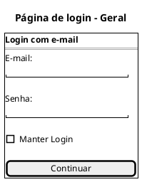
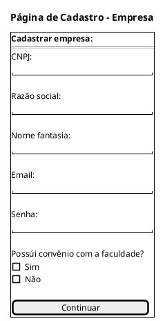
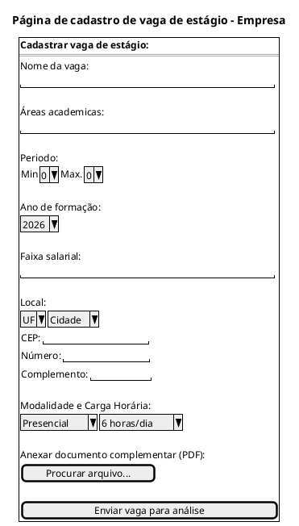
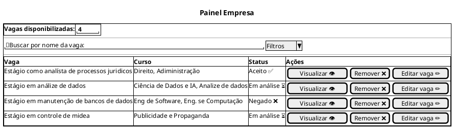
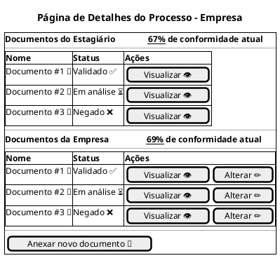
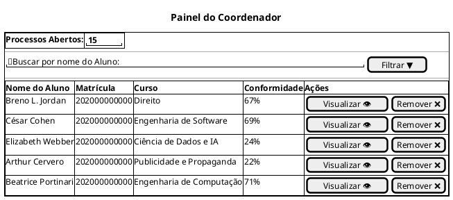
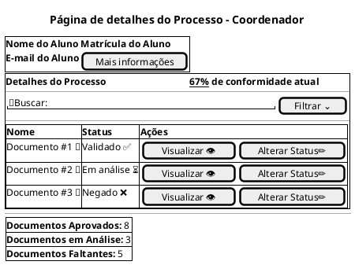
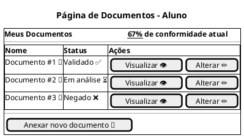
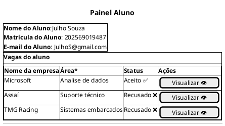

## Introdução

A construção do protótipo de baixa fidelidade auxilia a equipe de desenvolvimento a alcançar uma visualização simples do software para que tenham um norte na hora de passar para código.

## Metodologia

Iniciamos o projeto através dos levantamentos iniciais da equipe, após discussões a ferramenta PlantUML foi a selecionada para a confecção das diferentes páginas desse processo.

## Protótipo de baixa fidelidade

### Tela Login - Geral

### Página de Cadastro - Empresa

### Página de cadastro de vaga de estágio - Empresa

### Painel Empresa

### Página de Detalhes do Processo - Empresa

### Painel do Coordenador

### Página de detalhes do Processo - Coordenador

### Página de detalhes do Processo - Aluno

### Painel do Aluno

## Conclusão

A partir da elaboração do protótipo foi possível ter uma noção inicial de como é a ideia do software e como deve ser traduzida para código.

## Autor(es)

| Data     | Versão | Descrição                            | Autor(es)                                                                            |
| -------- | ------- | -------------------------------------- | ------------------------------------------------------------------------------------ |
| 15/04/2026 | 1.0 | Criação do Documento | Roger Pires e Vinicius Machado |

## Dados do Documento
>id: prototipobaixafidelidade-Estágios   title: Protótipo Baixa Fidelidade para Gerenciamento de Estágios para a IBMEC
