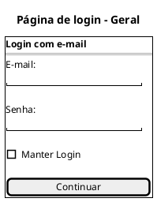
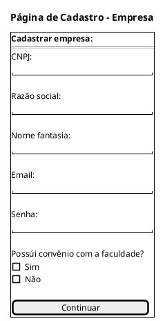
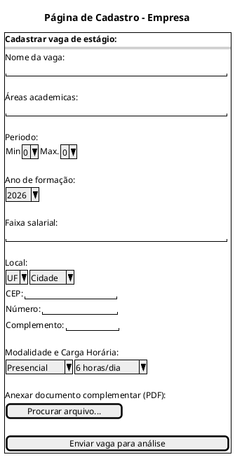
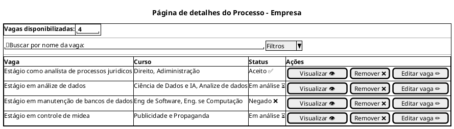
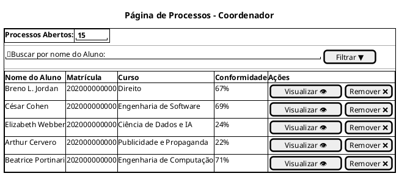
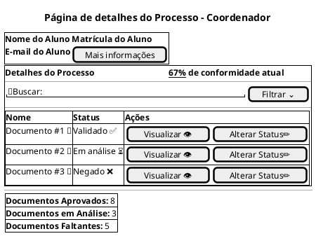
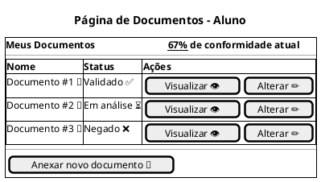

## Introdução

A construção do protótipo de alta fidelidade auxilia a equipe de desenvolvimento a encontrar um nível de detalhes abrangentes, extrair funcionalidades, testar usabilidade, e também fornece uma base para o gerenciamento do projeto pois com o protótipo é possível realizar estimativas de quanto tempo será necessário desempenhar em cada funcionalidade.

## Metodologia

Iniciamos o projeto através dos levantamentos iniciais da equipe, após discussões a ferramenta Figma foi selecionada para produzir o protótipo de alta fidelidade com auxílio do Material Design Color Tool.

## Protótipo de alta fidelidade

### Versão 1.0

### Tela Login

### Tela Cadastro - Empresa

### Página de inscrição de vaga de estágio

### Página de detalhes do Processo - Empresa

### Página de Processos - Coordenador

### Página de detalhes do Processo - Coordenador

### Tela de documentos - Aluno

Na primeira versão do protótipo utilizamos a ferramenta <a href="https://material.io/resources/color/#!/?view.left=0&view.right=0">Material Design Color Tool</a>  para auxiliar na criação da paleta de cores do aplicativo, definimos as cores base do aplicativo mas as cores definidas para as telas 12 e 13 ainda não foram decididas.

### Versão 2.0

### Versão 1.0

### Tela Login

### Tela Cadastro 1

### Tela Cadastro 2

### Tela Esqueceu Senha

### Tela do Feed

### Tela Feed com configurações

### Tela Perfil

### Tela Cadastrar torneio 1

### Tela Cadastrar torneio 2

### Tela Cadastrar torneio 3

### Tela Cadastrar torneio 4

### Tela com meus torneios

### Tela de inscrição em torneio

link para o `<a href="https://www.figma.com/">`Protótipo`</a>`

## Conclusão

A partir da elaboração do protótipo foi possível ter uma noção inicial da interface do usuário, definindo fluxo, paleta de cores, botões, app bars e diversas outras funcionalidades

## Referências

## Autor(es)

| Data     | Versão | Descrição                            | Autor(es)                                                                            |
| -------- | ------- | -------------------------------------- | ------------------------------------------------------------------------------------ |
| | 1.0 | | |
| | 1.1 | | |
| | 1.2 | | |
| | 2.0 | | |
